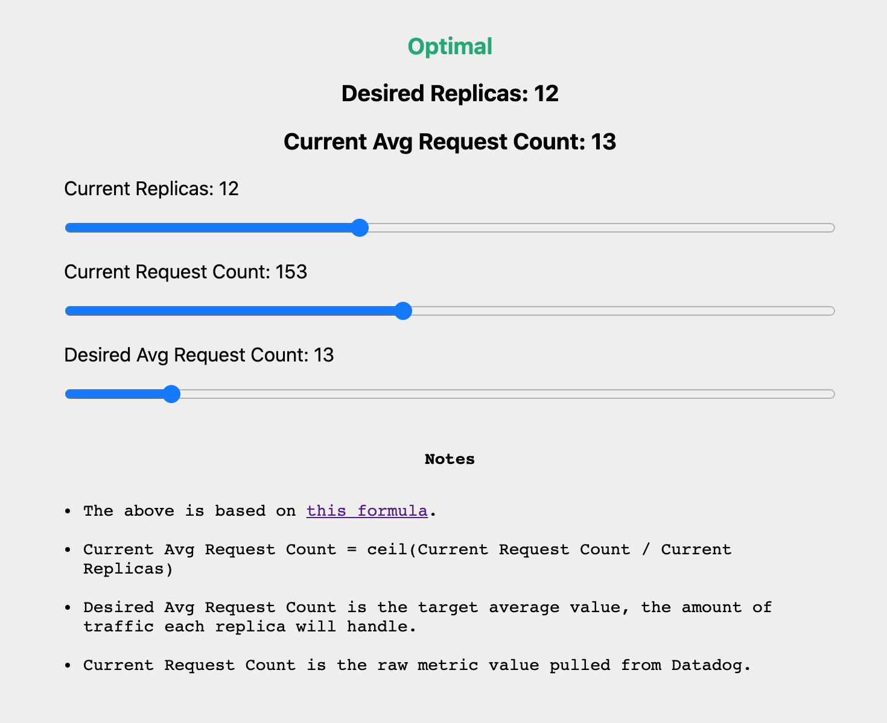

# HPA Desired Replicas Calculator

Trying to get a better feel for how the different variables in the desired replicas calculation relate to each other.

For more info, see https://kubernetes.io/docs/tasks/run-application/horizontal-pod-autoscale/#algorithm-details

[Try it out!](https://jaydeesimon.github.io/hpa-calc/)

## Development

To get an interactive development environment run:

    lein fig:build

This will auto compile and send all changes to the browser without the
need to reload. After the compilation process is complete, you will
get a Browser Connected REPL. An easy way to try it is:

    (js/alert "Am I connected?")

and you should see an alert in the browser window.

To clean all compiled files:

	lein clean

To create a production build run:

	lein clean
	lein fig:min
